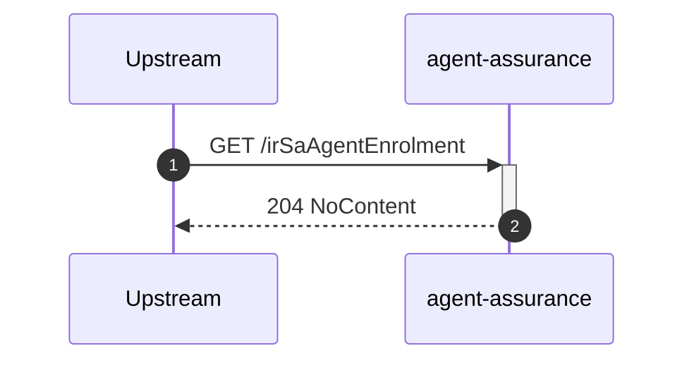
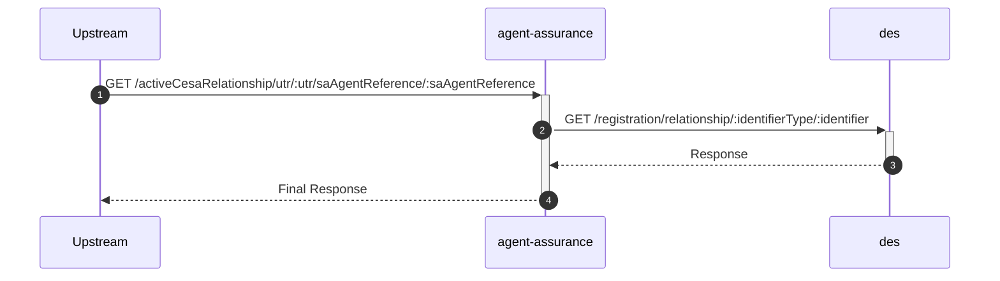
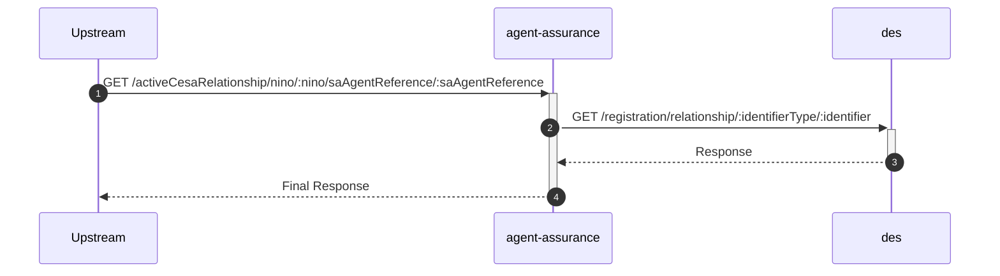
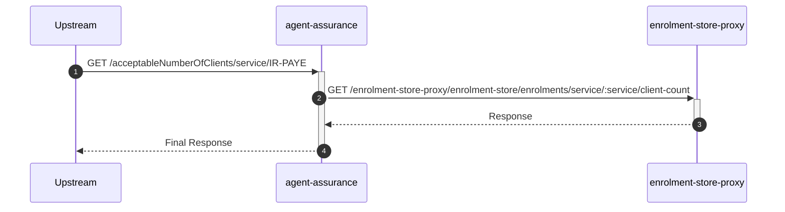
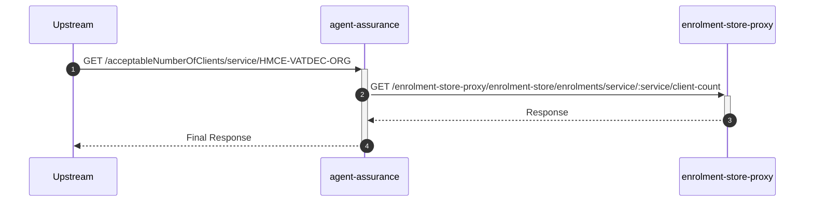
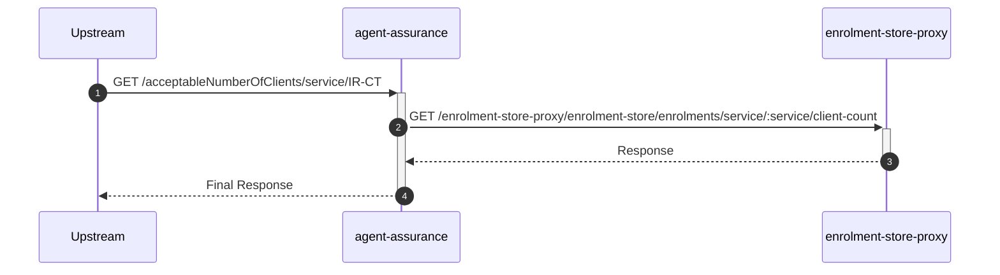

# agent-assurance

## AgentAssuranceController

---

## GET /irSaAgentEnrolment

**Description:** Checks if the agent is enrolled for IR-SA.

### Sequence of Interactions

(No interactions)

### Sequence Diagram

---

## GET /activeCesaRelationship/utr/:utr/saAgentReference/:saAgentReference

**Description:** Checks for an active CESA relationship for a given UTR.

### Sequence of Interactions

1. **API Call:** `GET /registration/relationship/:identifierType/:identifier` to `des`

### Sequence Diagram

---

## GET /activeCesaRelationship/nino/:nino/saAgentReference/:saAgentReference

**Description:** Checks for an active CESA relationship for a given NINO.

### Sequence of Interactions

1. **API Call:** `GET /registration/relationship/:identifierType/:identifier` to `des`

### Sequence Diagram

---

## GET /acceptableNumberOfClients/service/IR-PAYE

**Description:** Checks if the agent has an acceptable number of PAYE clients.

### Sequence of Interactions

1. **API Call:** `GET /enrolment-store-proxy/enrolment-store/enrolments/service/:service/client-count` to `enrolment-store-proxy`

### Sequence Diagram

---

## GET /acceptableNumberOfClients/service/IR-SA

**Description:** Checks if the agent has an acceptable number of IR-SA clients.

### Sequence of Interactions

1. **API Call:** `GET /enrolment-store-proxy/enrolment-store/enrolments/service/:service/client-count` to `enrolment-store-proxy`

### Sequence Diagram

---

## GET /acceptableNumberOfClients/service/HMCE-VATDEC-ORG

**Description:** Checks if the agent has an acceptable number of VAT DEC clients.

### Sequence of Interactions

1. **API Call:** `GET /enrolment-store-proxy/enrolment-store/enrolments/service/:service/client-count` to `enrolment-store-proxy`

### Sequence Diagram

---

## GET /acceptableNumberOfClients/service/IR-CT

**Description:** Checks if the agent has an acceptable number of IR-CT clients.

### Sequence of Interactions

1. **API Call:** `GET /enrolment-store-proxy/enrolment-store/enrolments/service/:service/client-count` to `enrolment-store-proxy`

### Sequence Diagram

