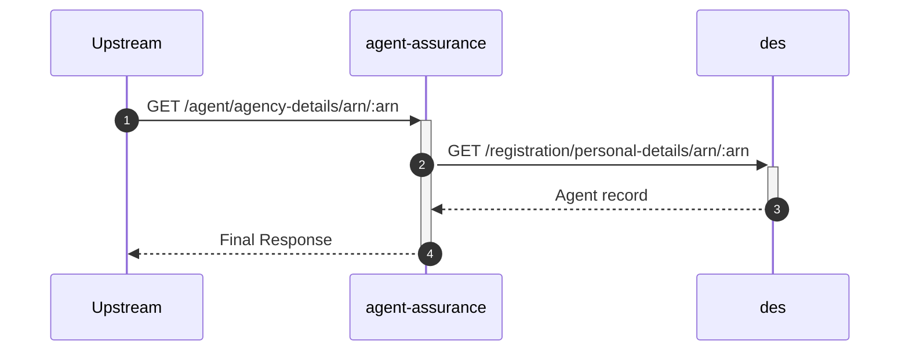
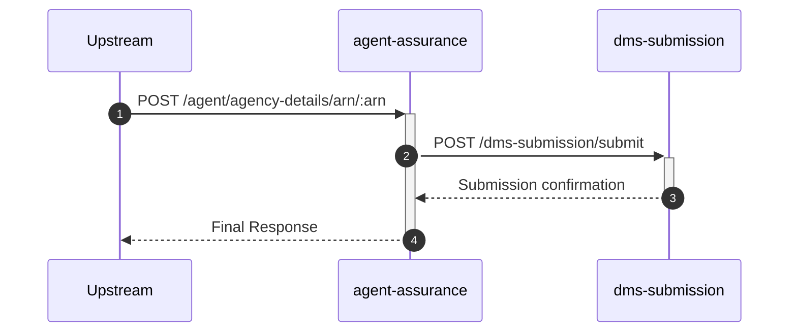

# agent-assurance

## AgentServicesController

---

## `GET /agent/agency-details/arn/:arn`

**Description:** Retrieves agency details for a given ARN.

### Sequence of Interactions

1. **API Call:** `GET /registration/personal-details/arn/:arn` to `des` - Get agent record from DES

### Sequence Diagram

---

## `POST /agent/agency-details/arn/:arn`

**Description:** Submits agency details to DMS.

### Sequence of Interactions

1. **API Call:** `POST /dms-submission/submit` to `dms-submission` - Submit document to DMS

### Sequence Diagram

