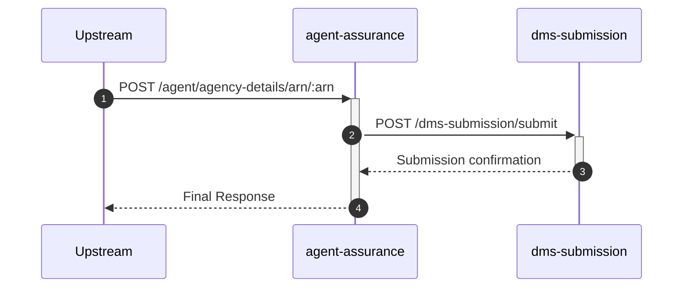

# agent-assurance

## AgentServicesController

---

## `POST /agent/agency-details/arn/:arn`

**Description:** Submits agency details to DMS.

### Sequence of Interactions

1. **API Call:** `POST /dms-submission/submit` to `dms-submission` - Submit document to DMS

### Sequence Diagram

```mermaid
sequenceDiagram
    autonumber
    participant Upstream
    participant agent-assurance
    participant dms-submission

    Upstream->>+agent-assurance: POST /agent/agency-details/arn/:arn
    agent-assurance->>+dms-submission: POST /dms-submission/submit
    dms-submission-->>-agent-assurance: Submission confirmation
    agent-assurance-->>-Upstream: Final Response
```
