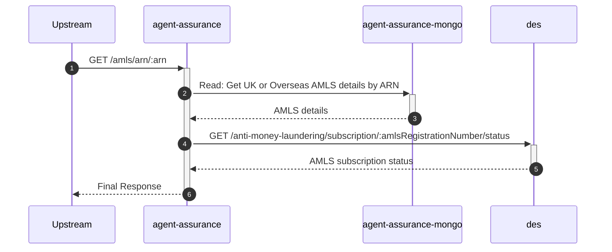
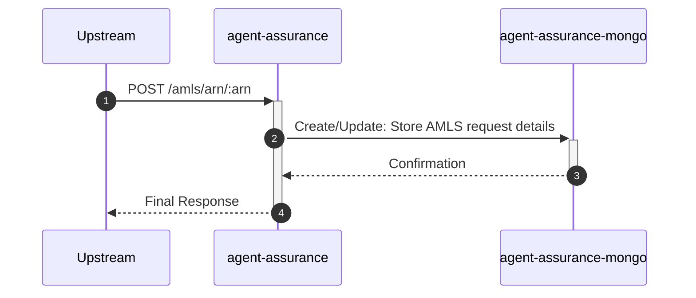

# agent-assurance

## AmlsDetailsByArnController

---

## `GET /amls/arn/:arn`

**Description:** Retrieves AMLS details for a given ARN.

### Sequence of Interactions

1. **Database:** Read: Get UK or Overseas AMLS details by ARN from `agent-assurance-mongo`
2. **API Call:** `GET /anti-money-laundering/subscription/:amlsRegistrationNumber/status` to `des` - Get AMLS subscription status

### Sequence Diagram

---

## `POST /amls/arn/:arn`

**Description:** Stores AMLS details for a given ARN.

### Sequence of Interactions

1. **Database:** Create/Update: Store AMLS request details in `agent-assurance-mongo`

### Sequence Diagram

