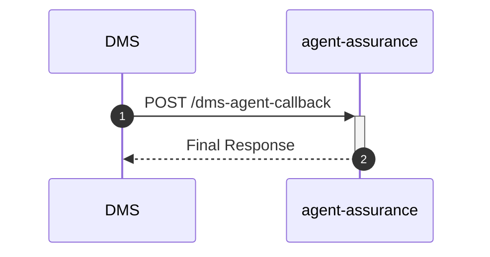

# agent-assurance

## DmsNotificationController

---

## `POST /dms-agent-callback`

**Description:** Handles DMS notification callbacks.

### Sequence of Interactions

1. **Internal Processing:** Handles callback notification from DMS system

### Sequence Diagram

