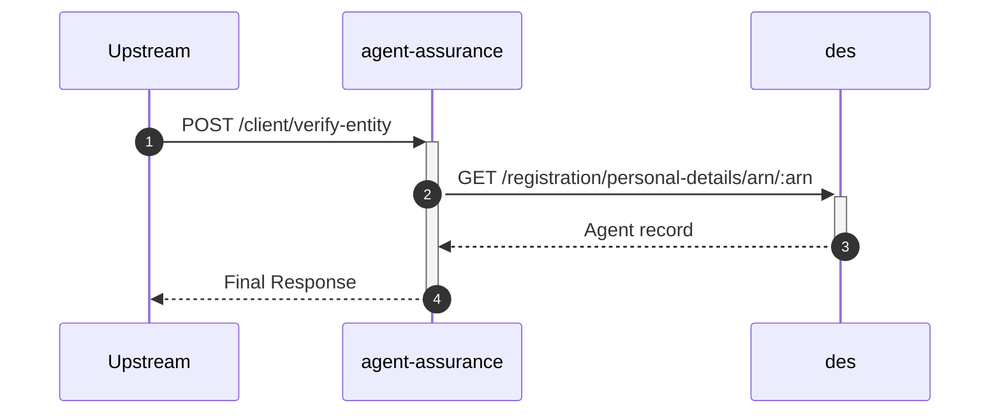

# agent-assurance

## EntityCheckController

---

## `POST /agent/verify-entity`

**Description:** Verifies an agent's entity based on their ARN.

### Sequence of Interactions

1. **API Call:** `GET /registration/personal-details/arn/:arn` to `des` - Get agent record from DES

### Sequence Diagram

---

## `POST /client/verify-entity`

**Description:** Verifies an agent's entity based on an identifier provided by a client.

### Sequence of Interactions

1. **API Call:** `GET /registration/personal-details/arn/:arn` to `des` - Get agent record from DES

### Sequence Diagram

