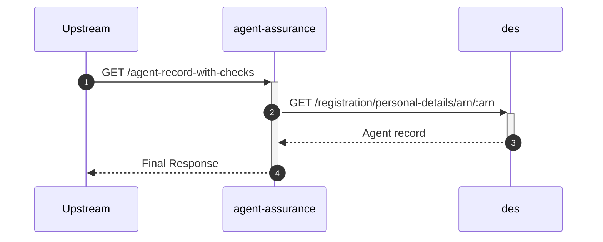
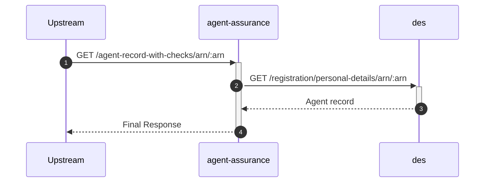

# agent-assurance

## GetAgentRecordWithEntityChecksController

---

## `GET /agent-record-with-checks`

**Description:** Retrieves the agent record with entity checks for the authenticated agent.

### Sequence of Interactions

1. **API Call:** `GET /registration/personal-details/arn/:arn` to `des` - Get agent record from DES

### Sequence Diagram

---

## `GET /agent-record-with-checks/arn/:arn`

**Description:** Retrieves the agent record with entity checks for a given ARN (for clients).

### Sequence of Interactions

1. **API Call:** `GET /registration/personal-details/arn/:arn` to `des` - Get agent record from DES

### Sequence Diagram

