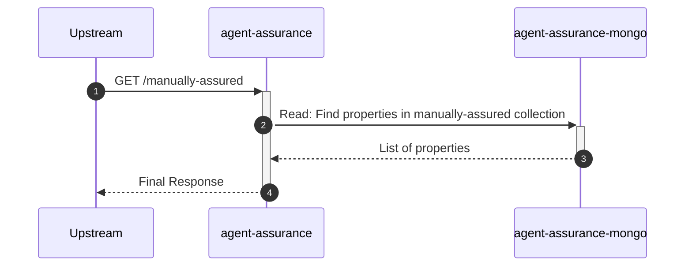
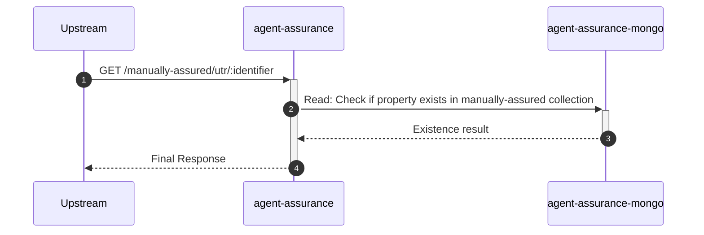
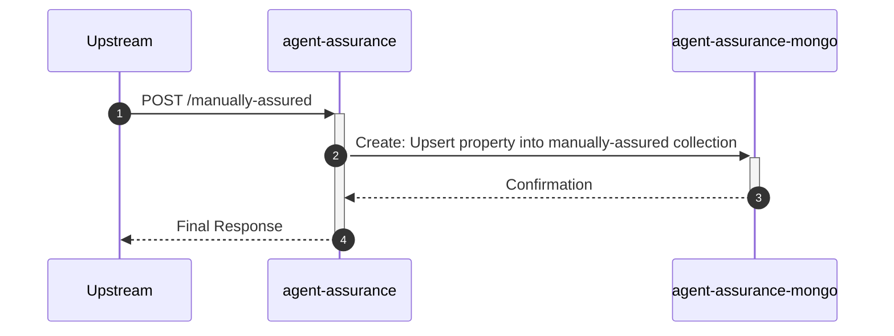
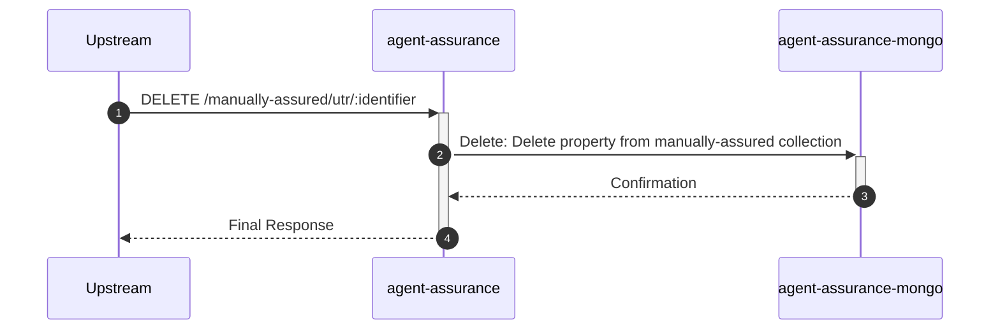

# agent-assurance

## MaaController

---

## `GET /manually-assured`

**Description:** Retrieves a paginated list of manually assured UTRs.

### Sequence of Interactions

1. **Database:** Read: Find properties in the 'manually-assured' collection from `agent-assurance-mongo`

### Sequence Diagram

---

## `GET /manually-assured/utr/:identifier`

**Description:** Checks if a UTR is manually assured.

### Sequence of Interactions

1. **Database:** Read: Check if property exists in the 'manually-assured' collection from `agent-assurance-mongo`

### Sequence Diagram

---

## `POST /manually-assured`

**Description:** Creates a manually assured property.

### Sequence of Interactions

1. **Database:** Create: Upsert a property into the 'manually-assured' collection in `agent-assurance-mongo`

### Sequence Diagram

---

## `DELETE /manually-assured/utr/:identifier`

**Description:** Deletes a manually assured property.

### Sequence of Interactions

1. **Database:** Delete: Delete a property from the 'manually-assured' collection in `agent-assurance-mongo`

### Sequence Diagram

