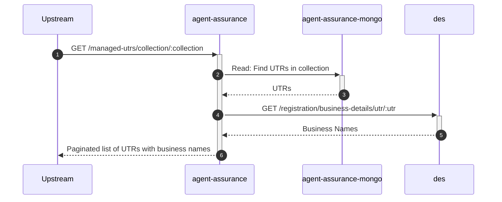
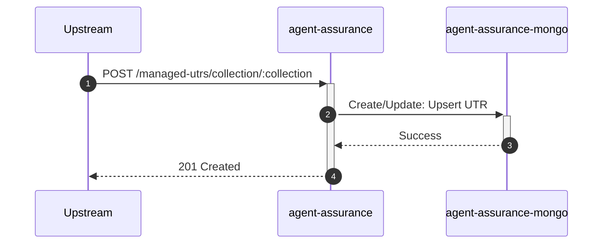
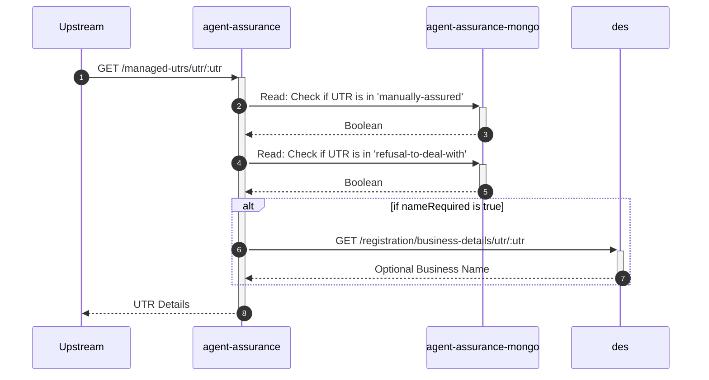
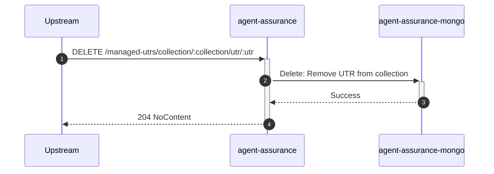

# agent-assurance

## ManagedUtrsController

---

## GET /managed-utrs/collection/:collection

**Description:** Lists UTRs for a given collection with pagination.

### Sequence of Interactions

1. **Database:** Read: Find UTRs in the specified collection.
2. **API Call:** `GET /registration/business-details/utr/:utr` to `des` to get business names.

### Sequence Diagram

---

## POST /managed-utrs/collection/:collection

**Description:** Adds or updates a UTR in a specified collection.

### Sequence of Interactions

1. **Database:** Create/Update: Upsert the UTR property into the specified collection.

### Sequence Diagram

---

## GET /managed-utrs/utr/:utr

**Description:** Gets details for a specific UTR, including assurance status and optionally the business name.

### Sequence of Interactions

1. **Database:** Read: Check if UTR exists in the 'manually-assured' collection.
2. **Database:** Read: Check if UTR exists in the 'refusal-to-deal-with' collection.
3. **API Call:** `GET /registration/business-details/utr/:utr` to `des` to get business name if requested.

### Sequence Diagram

---

## DELETE /managed-utrs/collection/:collection/utr/:utr

**Description:** Removes a UTR from a specified collection.

### Sequence of Interactions

1. **Database:** Delete: Delete the UTR property from the specified collection.

### Sequence Diagram

