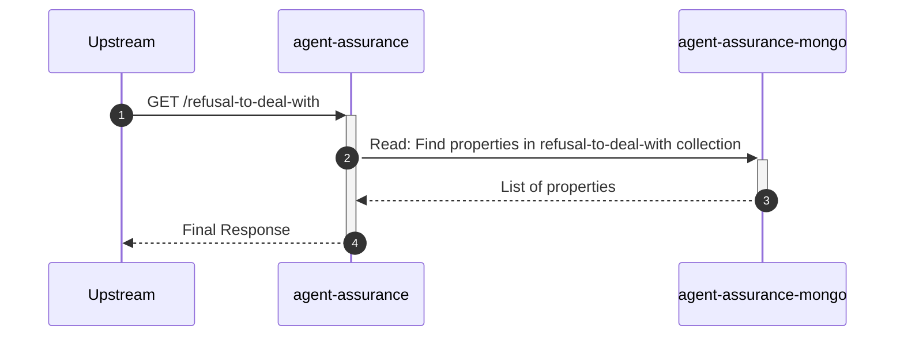
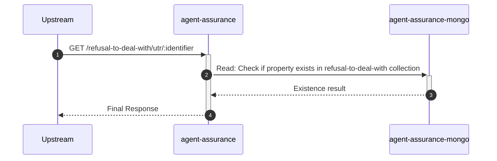
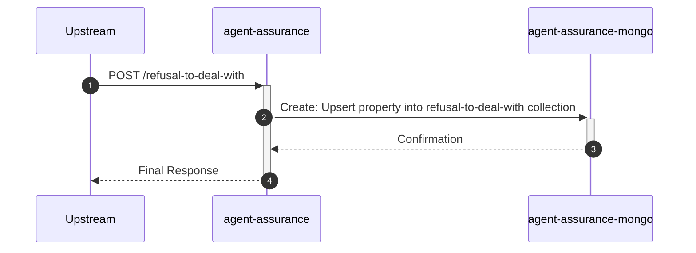
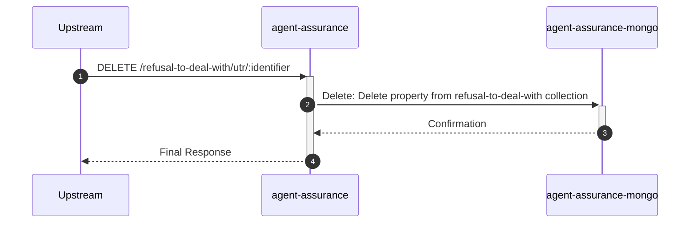

# agent-assurance

## R2dwController

---

## `GET /refusal-to-deal-with`

**Description:** Retrieves a paginated list of UTRs on the refusal to deal with list.

### Sequence of Interactions

1. **Database:** Read: Find properties in the 'refusal-to-deal-with' collection from `agent-assurance-mongo`

### Sequence Diagram

---

## `GET /refusal-to-deal-with/utr/:identifier`

**Description:** Checks if a UTR is on the refusal to deal with list.

### Sequence of Interactions

1. **Database:** Read: Check if property exists in the 'refusal-to-deal-with' collection from `agent-assurance-mongo`

### Sequence Diagram

---

## `POST /refusal-to-deal-with`

**Description:** Creates a refusal to deal with property.

### Sequence of Interactions

1. **Database:** Create: Upsert a property into the 'refusal-to-deal-with' collection in `agent-assurance-mongo`

### Sequence Diagram

---

## `DELETE /refusal-to-deal-with/utr/:identifier`

**Description:** Deletes a refusal to deal with property.

### Sequence of Interactions

1. **Database:** Delete: Delete a property from the 'refusal-to-deal-with' collection in `agent-assurance-mongo`

### Sequence Diagram

